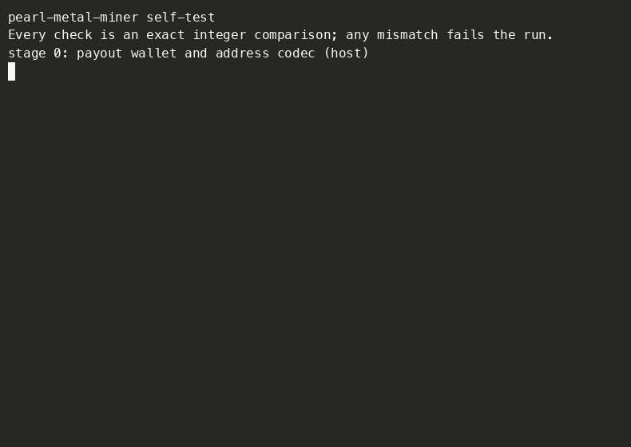

# pearl-metal-miner

[](https://github.com/jonathanbtc/pearl-metal-miner/actions/workflows/ci.yml)


[](https://github.com/jonathanbtc/pearl-metal-miner/releases/latest)

Pool mining for Pearl (PRL) on Apple Silicon — any M-series Mac, M1 through
M5 — with a hand-written Metal compute backend. Apache-2.0, **no developer fee**.
**Not affiliated with Pearl Research Labs.**

Built from the ISC-licensed
[`pearl-research-labs/pearl`](https://github.com/pearl-research-labs/pearl)
upstream: the host commitment, proof construction and local verification are
upstream's own `py-pearl-mining` machinery; the mining hot loop — noise
generation, noise application, and the fused GEMM → transcript → keyed-BLAKE3
proof-of-work sweep — is implemented from scratch in Metal Shading Language
and compiled at process start (no Xcode required, Command Line Tools only).



*Real recording, shown at 3× (source: [`docs/media/demo.cast`](docs/media/demo.cast)):
self-test → live dashboard → a real `share ACCEPTED` reply from LuckyPool.
Recorded on the pool's low-difficulty CPU port so you don't watch for an
hour — at normal difficulty a share takes ~1 h on an M1 Max.*

---

## Read this first: you will not make money

At the network conditions measured 2026-08-02 (PRL $0.26, 28.54 EH/s), a
top-end GPU earns ~$0.06/day and an M1 Max draws $0.25–0.75/day of
electricity. **Mining PRL on a Mac loses roughly 9× what it earns**, and pool
payout thresholds mean small balances may never be paid out at all.

This project exists to demonstrate a bit-exact Metal implementation of the
Pearl proof-of-work and pool pipeline — a pool-accepted share from a
hand-written Metal kernel — not to make anyone money. Run it because you find
that interesting, on those terms.

## Why trust it: run the self-test

This domain fails silently: a subtly wrong kernel doesn't crash, it burns
electricity producing shares every pool rejects. So the first supported
command is a live differential of **every GPU stage** against the reference
implementation, on **your** machine, ending with a proof crafted from GPU
output that upstream's own Rust consensus verifier must accept:

```sh
.venv/bin/python -m pearl_metal_miner.miner --self-test
```

It prints `SELF-TEST PASS` and exits 0, or names the exact stage that
diverged and exits non-zero. **Do not mine on a build that fails it.**

Verified by the authors on: Apple M1 Max, macOS 14.4.1. Every other machine:
that's what the self-test is for. A complete cold-start run on that machine
— README commands only, through to a pool-accepted share and the address
visible on the pool — is recorded in
[docs/research/2026-08-11-first-user-run-accepted-share.md](docs/research/2026-08-11-first-user-run-accepted-share.md).

---

## Setup from A to Z

### 0. What you need

| requirement | why | check with |
| ----------- | --- | ---------- |
| Mac with Apple Silicon — any M-series generation (M1–M5), any variant (base/Pro/Max/Ultra), any model (MacBook Air/Pro, mini, Studio, iMac) | the kernels are Metal, unified-memory | `uname -m` → `arm64` |
| macOS 14+ (earlier may work, untested) | Metal runtime shader compilation | `sw_vers` |
| Xcode **Command Line Tools** (not Xcode) | `clang++` for the host library | `xcode-select -p` |
| Python **3.12 or newer** | the upstream extension targets abi3-py312 | `python3 --version` (a versioned `python3.12`/`3.13`/`3.14` on PATH also counts — `setup.sh` finds them) |
| Rust (cargo) | builds upstream's `py-pearl-mining` once | `cargo --version` |
| ~2 GB disk, ~1.5 GB free RAM while mining | upstream clone + two 8192×4096 grids | |

Intel Macs, virtual machines, and anything without a Metal GPU are not
supported — the self-test will tell you immediately.

### 1. Install the build tools (one-time)

```sh
# Command Line Tools (a dialog opens; ~5 minutes):
xcode-select --install

# Python 3.12+, if `python3 --version` is older — e.g. via Homebrew:
brew install python@3.12   # @3.13 / @3.14 equally fine
# (no Homebrew? https://brew.sh, or the installer from python.org)

# Rust, if you don't have it:
curl --proto '=https' --tlsv1.2 -sSf https://sh.rustup.rs | sh
# then open a new terminal so `cargo` is on PATH
```

### 2. Get the code and build it

```sh
git clone https://github.com/jonathanbtc/pearl-metal-miner.git
cd pearl-metal-miner

./packaging/setup.sh        # venv + deps, upstream at the pinned commit, builds py-pearl-mining
./packaging/build_macos.sh  # compiles build/libpearlmetal.dylib (clang++ only, seconds)
```

`setup.sh` is idempotent — run it again after a `git pull` and it only redoes
what changed. Everything it creates lives inside this folder (`.venv/`,
`pearl/`, `build/`); **uninstalling is deleting the folder**.

### 3. Prove the build is correct

```sh
.venv/bin/python -m pearl_metal_miner.miner --self-test
```

Expected: ~50 `[ok ]` lines and `SELF-TEST PASS`. If it fails, don't mine —
see [Troubleshooting](#troubleshooting).

### 4. Get an address to mine to

Mining pays a Pearl address (they look like `prl1p…`). If you already run a
Pearl wallet, use its receive address in step 5. Otherwise the repo includes
everything needed to make one — nothing else to install:

```sh
.venv/bin/python -m pearl_metal_miner.wallet new
```

This generates a keypair locally, writes it to `wallet.json` (file mode
0600, gitignored), prints your payout address, and the miner uses it
automatically whenever you omit `--address`. Three things to understand:

- **The file is the money.** The private key in `wallet.json` is the only
  claim on anything mined to the address. Back the file up; if the only copy
  is lost, the funds are lost with it. For amounts you'd mind losing, prefer
  an established Pearl wallet's address instead.
- **It receives; it doesn't spend.** This is a key file, not a wallet app —
  no balances, no sending. To spend later, import the private key
  (`… wallet show --reveal-private-key`) into any taproot-capable wallet.
- **It's checked like everything else here.** The key→address derivation is
  differentially tested in `--self-test` (stage 0, against the address
  library upstream's own gateway uses), every address — yours included — is
  validated before the miner connects (a typo would otherwise mine value
  nobody can claim), and `… wallet verify` re-checks the file any time.

(Checkouts from before 2026-08-10 created `burner_wallet.json` via
`tools/make_burner_wallet.py`. That file keeps working as-is, and the old
tool now forwards here.)

### 5. Tell it your settings once, then mine

```sh
.venv/bin/python -m pearl_metal_miner.miner init   # one-time Q&A → config.toml
.venv/bin/python -m pearl_metal_miner.miner        # mines with those settings
```

`init` asks a few questions — pool, payout address (it offers to create the
step-4 wallet if you skipped it), worker label, and three assumptions: your
electricity price, an assumed PRL price, an assumed network hashrate, each
prefilled with a dated figure. It writes a commented `config.toml` next to
`wallet.json`; uninstalling is still deleting the folder. Everything
money-related the miner ever shows derives from those three values — your
assumptions, never a live feed — and the miner contacts nothing but the
pool.

CLI flags always override the file, so one-off experiments stay one-liners
(`--intensity 40`, `--worker othermac`, a full `--address … --pool …`
invocation with no config at all — every pre-config command keeps working).

Both supported pools are exercised live (wire evidence in
`docs/research/2026-08-10-pool-survey.md`), but they are verified to
different depths — stated exactly:

| `--pool` | endpoint | difficulty | verified |
| -------- | -------- | ---------- | -------- |
| `luckypool` (default) | `pearl-eu1.luckypool.io:3360` | varDiff (starts ≈888,888) | ✅ pool-accepted shares — three, pool-side confirmed 2026-08-11 ([evidence](docs/research/2026-08-11-first-user-run-accepted-share.md)) |
| `kryptex` | `prl-eu.kryptex.network:7048` | fixed 2,097,152 | ⚠️ connects, authorizes, streams jobs live; **no accepted share yet** — its fixed difficulty makes shares ~hourly, so verification is slow. If you get one accepted here, please open an issue with the log lines |

`--worker` is any label you like; the pool's dashboard shows your stats under
`address.worker`. Other endpoints of the same pools can be reached with
`--host`/`--port`.

Stop with `Ctrl-C` (or send SIGTERM). Nothing needs cleanup — the pool just
sees you disconnect — and the miner prints a session summary on the way out:
tiles searched, average speed, shares accepted/rejected.

### 6. Read what it prints

Run in a terminal, the miner keeps a **live dashboard** pinned to the bottom
of the window — device, pool, status (mining / reconnecting), rolling and
session speed, shares with accept %, time since the last share, and an
"est." time-to-next-share from the live job's target — while the log lines
below keep scrolling above it. Redirect or pipe the output (`… | tee
mining.log`) and the dashboard steps aside automatically: plain logs only,
no control codes, same as `--no-dashboard`. The logs are the source of
truth; the panel just watches them.

```
[15:39:43] device Apple M1 Max, threadgroup mem 32768, max threads 1024
[15:39:43] pow kernel: blocked fast path (v2)          ← default job shape = fastest kernel
[15:39:44] job 973ef27c_888888 height=98020: grid #1 ready in 0.50s (~2^223 bound, 524288 tiles/grid)
[15:40:13] 1.075M tiles/s (60s) | 1.032M/s session | shares 0 acc / 0 rej | up 0:00:30
```

- **tiles/s** is your search speed — first the last minute's rate (this is the
  number that moves when you change intensity or the machine heats up), then
  the whole-session average. An M1 Max at full intensity does ~2.3M — and you
  don't have to take that on faith or join a pool to check yours:
  `--benchmark` measures this Mac offline in about a minute and prints a
  shareable result.
- A **share** is a winning tile, verified locally, submitted, and judged by
  the pool. At current pool difficulties expect the **first accepted share to
  take from tens of minutes to hours** — it's a lottery, and long dry spells
  are normal, not a bug. Every submission is logged either
  `share ACCEPTED` or `share REJECTED` with the pool's raw reply.
- An accepted share also pops a **macOS notification**, so the payoff moment
  reaches you even when the terminal is buried. `--no-notify` turns it off.
- The miner **verifies every share locally at share difficulty before
  submitting**. If you ever see `LOCAL VERIFY FAILED`, it refused to submit a
  bad share — run `--self-test` and open an issue.

### 7. Keep the Mac usable — and keep it mining

Mining takes the GPU and, during grid preparation, some CPU. Three controls:

```sh
--intensity 60        # GPU duty cycle, 1–100 (default 100)
--cpu-threads 4       # CPU cores for grid preparation (default 4)
--auto-intensity      # ramp to 100 after 5 idle minutes, drop back on input
```

`--intensity 60 --auto-intensity` is the "polite laptop" setting: ~60% GPU
while you work, full speed when you walk away.

On battery, the miner **pauses by default** — burning a battery for
fractions of a cent isn't a default anyone wants — and resumes on AC by
itself, with a macOS notification both ways. `--on-battery low` mines at
intensity 25 instead, `--on-battery full` mines on with a single warning
(config key: `on_battery`). Desktops are unaffected; unplug detection polls
`pmset` every ~20 s, and any detection failure counts as AC — a desktop can
never pause by mistake.

To keep it mining unattended, add:

```sh
--keep-awake          # hold off system sleep while the miner runs
```

This spawns macOS's own `caffeinate` tied to the miner's lifetime: the Mac
won't idle-sleep while mining, the assertion disappears the moment the miner
exits (Ctrl-C included — check `pmset -g assertions` if you're curious), and
the *display* is deliberately still allowed to sleep. A closed laptop lid
still wins, and App Nap is already handled by an activity token inside the
Metal context, `--keep-awake` or not.

There is intentionally no start-at-login service: at today's difficulty this
miner is a hobby, not an income, and auto-starting it would burn your
electricity without you choosing to. Keeping it running stays a conscious
act — a terminal window and `--keep-awake` is the whole story.

**About the money line.** The dashboard's verdict (`est. −$0.11/day at your
assumptions`) is computed entirely offline from the three `config.toml`
assumptions and your measured tiles/s — the derivation is one commented
function, `pearl_metal_miner/economics.py`. The watts figure is an
**estimate from a per-chip table**, because measuring real GPU power needs
root and **the miner never asks for your password**. Want the real number?
Run Apple's own tool yourself in another terminal while mining:

```sh
sudo powermetrics --samplers gpu_power -i 1000 -n 5
```

### Prefer to have an AI assistant do all this?

[`PROMPT_FOR_AI_DEV.md`](PROMPT_FOR_AI_DEV.md) contains a ready-to-paste
prompt for an AI coding agent (Claude Code, Cursor, Copilot Workspace, …)
that walks a fresh Apple Silicon Mac through this entire setup — with the
self-test as a hard gate — and starts mining politely.

---

## All flags

| flag | default | meaning |
| ---- | ------- | ------- |
| `--pool {kryptex,luckypool}` | `luckypool` | which pool dialect + endpoint |
| `--address prl1p…` | your `wallet.json` | payout address, validated before connecting |
| `--worker NAME` | `m1` | worker label shown on the pool dashboard |
| `--host`, `--port` | per pool | override the pool endpoint |
| `--intensity 1-100` | `100` | GPU duty cycle |
| `--auto-intensity` | off | treat `--intensity` as the floor; 100 when idle 5 min |
| `--cpu-threads N` | `4` | cap on grid-preparation CPU threads |
| `--self-test` | — | run the differential test suite and exit |
| `--benchmark` | — | offline speed test (~1 min): your tiles/s + economics verdict + paste-ready block |
| `--benchmark-seconds S` | `45` | measured duration of the benchmark after warmup |
| `--version` | — | version + third-party notices, then exit |
| `--max-accepted N` | `0` = never | stop after N accepted shares |
| `--time-limit S` | `0` = never | stop after S seconds |
| `--on-battery {pause,low,full}` | `pause` | unplugged laptop: pause (auto-resume on AC), cap intensity at 25, or mine on |
| `--keep-awake` | off | hold off system sleep while mining (released on exit) |
| `--no-notify` | notify on | silence macOS notifications for accepted shares |
| `--no-dashboard` | dashboard on | plain scrolling logs even in a terminal (auto-plain when piped) |
| `--max-job-age S` | `300` | watchdog: reconnect if the pool sends nothing for S seconds (`0` = off) |
| `--region-rows N` | `256` | tile rows per GPU dispatch (burst size; affects intensity granularity) |
| `--m/--n/--k/--rank/--rows/--cols` | 8192/8192/4096/128/`0,32`/`0..63` | the job shape — see below |

**Job shape (advanced).** The defaults are both the shape the fast kernel is
built for and the shape observed in use by other miners on these pools;
changing them switches to the slower general kernel, and a `--rank` other
than 128 additionally carries a consensus difficulty penalty (the miner warns
you). Leave them alone unless you're experimenting — every shape is swept by
the same bit-exact machinery and locally verified, so experiments are safe,
just usually slower.

## Measured on real hardware

Rows come **only from linked evidence** — a `--benchmark` block or a live
measurement someone actually posted. M2–M5 are absent not because they don't
work (the self-test proves each machine for itself) but because nobody has
reported one yet. [Post yours](https://github.com/jonathanbtc/pearl-metal-miner/issues/37)
and get added with credit:

| chip | tiles/s | source |
| ---- | ------- | ------ |
| Apple M1 Max | 2.31M (AC) · 1.95M (battery) | [kernel v2 measured live — pool survey, 2026-08-10](docs/research/2026-08-10-pool-survey.md) · [`--benchmark`, 2026-08-11](https://github.com/jonathanbtc/pearl-metal-miner/issues/37#issuecomment-5252918616) |

## Troubleshooting

| symptom | cause / fix |
| ------- | ----------- |
| `python >= 3.12 required` | install 3.12+ (step 1) and rerun `setup.sh` — versioned installs (`python3.13` etc.) are found automatically |
| `Rust not found` | install rustup (step 1), open a new terminal, rerun `setup.sh`; installed but still not found: `. "$HOME/.cargo/env"` |
| `no Metal devices` | Intel Mac or VM — not supported |
| self-test **FAIL** | do not mine. Rerun once; if it persists, open a GitHub issue with the full output, your chip and macOS version — the failing stage names the exact kernel |
| `--address: …` rejected at startup | deliberate — the miner refuses to mine to an address the chain cannot pay (typo, wrong coin, wrong type). Re-paste it, or `… wallet show` prints your local one |
| `cannot resolve` / `timed out` / `cannot connect` at startup | pool down, or a firewall/VPN blocking the port; try the other pool, or `--host`/`--port` for a different region |
| `connection lost … reconnect attempt N in Ns` | normal on flaky networks; attempts back off 5→60 s forever and mining resumes on a fresh job |
| `WATCHDOG: nothing from the pool …` | the pool went quiet past `--max-job-age` (default 300 s); the miner reconnects rather than grind a stale job |
| shares `0/0` for a long time | normal — see step 6; check the pool dashboard shows your worker as connected |
| occasional `share REJECTED` | usually a stale share (job changed mid-flight) — harmless. Frequent rejects: run `--self-test`, then open an issue with the reject messages |
| `bound overflows 2^256 — refusing job` | the pool sent an unusably easy target; the miner waits for a sane job (open an issue if it persists) |
| Mac hot / fans loud | lower `--intensity`, or use `--auto-intensity` with a low floor |

**Seeing the wire.** `PRL_RAW=1 python -m pearl_metal_miner.miner …` logs
every raw stratum line in both directions. That's how the LuckyPool dialect
was reverse-engineered, and it's the starting point if you want to add a
pool: capture a session, then implement the four framing points of
`stratum/dialect.py`.

## FAQ

**Is there a fee?** No. At these economics a fee would be a rounding error
that costs more goodwill than it earns.

**Do I need to install a separate wallet?** No — step 4's included command
creates a local payout wallet: a real keypair, generated on your machine
with the OS's cryptographic randomness, its key→address math differentially
tested against the same address library upstream's gateway pays with. What
it is *not* is a wallet app: it shows no balance and sends nothing (the pool
dashboard shows what you've earned; spending means importing the key into a
taproot-capable wallet). It holds funds as safely as you hold its file.

**Why would a share be accepted at all if the code were wrong?** It wouldn't
— that's the design. Every stage is differentially tested against upstream's
reference (`--self-test`), and every live share is locally verified by
upstream's own Rust verifier before submission. A wrong integer anywhere
produces rejected shares, which is why the self-test exists and ships.

**Which Macs work?** Every Apple Silicon Mac: MacBook Air or Pro, mini,
Studio or iMac, on any M-series generation — M1, M2, M3, M4, M5 —
base/Pro/Max/Ultra alike. Nothing in the code is tuned to one chip: device
limits are queried at runtime, the shaders are compiled on *your* GPU at
startup, and the single micro-architectural assumption (32-lane simdgroups,
true of every Apple GPU shipped to date) is checked at startup and refuses
loudly if a future chip ever differs. We *expect* speed to scale with GPU
size — an M1 Max measures ~2.3M tiles/s at the default shape, and a bigger
GPU should be proportionally faster (the economics would scale the same
way, so it would lose money proportionally faster too) — but expectation
is not measurement: the [hardware table](#measured-on-real-hardware) holds
what's actually been measured, and your `--benchmark` can extend it. The
authors have hardware-verified M1 Max only; on any other chip,
`--self-test` *is* the verification — run it first, mine after it passes.
Intel Macs: no.

**Where did the pool protocols come from?** Kryptex and LuckyPool speak
different Stratum dialects. Both were reverse-engineered from live wire
traffic captured by `tools/pool_survey.py` (evidence in
`docs/research/2026-08-10-pool-survey.md`); no fee-licensed miner code was
ever read (see `docs/adr/0005`).

**Can I add a pool?** Yes — a dialect is one small subclass
(`pearl_metal_miner/stratum/`, ~50 lines: handshake, notify parsing, submit
framing). [CONTRIBUTING.md](CONTRIBUTING.md) has the recipe, including the
one hard sourcing rule (wire logs, never the fee-licensed repos).

**Can the kernel be used elsewhere?** Contributing it upstream or to other
projects is a welcome conversation now that it works; it is a port to offer,
not a promise made.

## Design notes

- `CONTEXT.md` — the domain glossary.
- `docs/adr/` — the decisions and their reasoning, including why the barred
  fee-licensed repositories were never read (ADR-0005), what a hash tile
  actually is (ADR-0007), and why the included wallet is a bare key file
  rather than a wallet app (ADR-0008).
- `pearl_metal_miner/reference.py` — the NumPy restatement of the consensus
  PoW every kernel is differentially tested against; itself pinned to
  upstream by `tools/phase05_experiments.py`.

## License

Apache-2.0 (`LICENSE`); third-party notices in `NOTICE`, also printed by
`--version`. Not affiliated with Pearl Research Labs.

**Patents.** This project's own code is Apache-2.0, which includes a patent
grant from its contributors. The upstream it builds on is ISC-licensed; ISC
has no patent language, so no patent promise flows from the original
authors. No patent search has been performed. This is disclosure, not legal
advice.

Contributions: see [CONTRIBUTING.md](CONTRIBUTING.md). Security reports:
[SECURITY.md](SECURITY.md).
